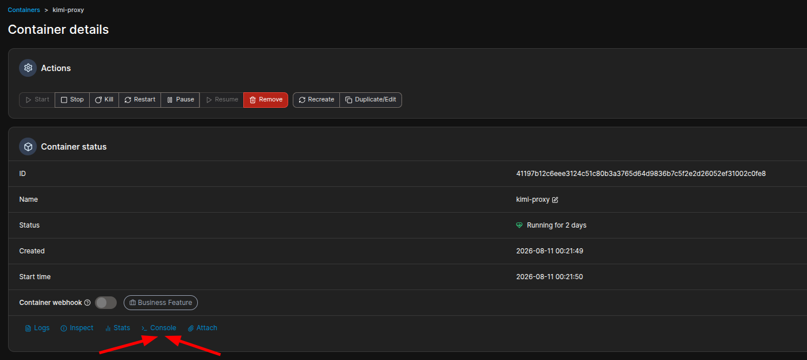
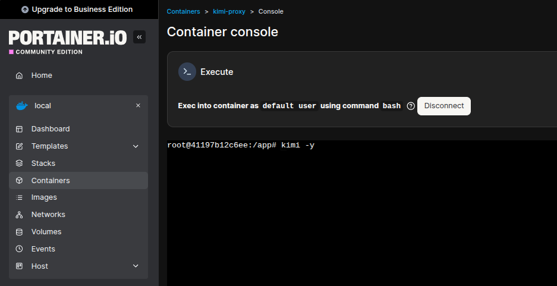
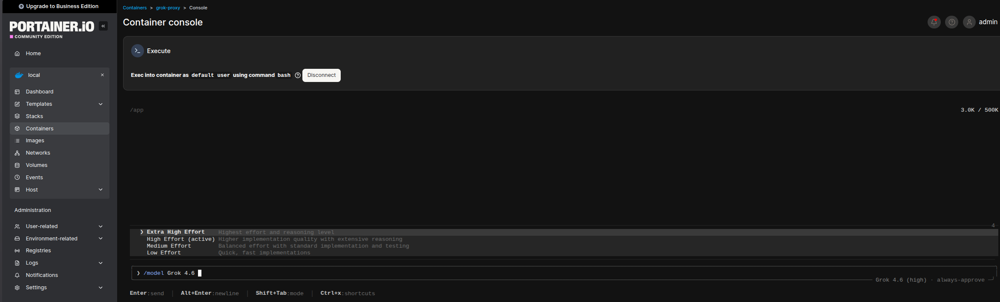

# Log in with Portainer (easiest way)

You only need to authenticate Grok once. The easiest way is through **Portainer CE**, a free web UI for Docker.

## 1. Install Portainer CE

If you do not have Portainer yet, install it with one command on your Docker server:

```bash
docker volume create portainer_data
docker run -d -p 8000:8000 -p 9443:9443 \
  --name portainer \
  --restart=unless-stopped \
  -v /var/run/docker.sock:/var/run/docker.sock \
  -v portainer_data:/data \
  portainer/portainer-ce:latest
```

Then open `https://YOUR_SERVER_IP:9443` and create an admin account.

> **Tip:** if you do not want to deal with HTTPS certificates, you can also run it on port 9000 with `-p 9000:9000` and open `http://YOUR_SERVER_IP:9000`.

## 2. Open the grok-proxy container console

1. In Portainer, go to **Containers**.
2. Click on the `grok-proxy` container.
3. Click **Console**.
4. Click **Connect**.

  <!-- optional: cropped to proxy row -->



## 3. Log in to Grok

Inside the console, run:

```bash
grok login --device-auth
```

Follow the instructions (open the URL in your browser, enter the code, use your Super Grok account).

## 4. Pick a model (optional)

You can also start an interactive session and choose a model:

```bash
grok
```

Then use `/model Grok 4.6` or similar.



## 5. Test the proxy

From another computer on the same network:

```bash
curl http://YOUR_SERVER_IP:8084/health
```

Replace `YOUR_SERVER_IP` with your Docker server's LAN IP and `8084` with the port you chose in `.env`.

---

**Same steps work for [bitcopath/kimi-proxy](https://github.com/bitcopath/kimi-proxy)** — just run `kimi login` inside the kimi-proxy container instead.
